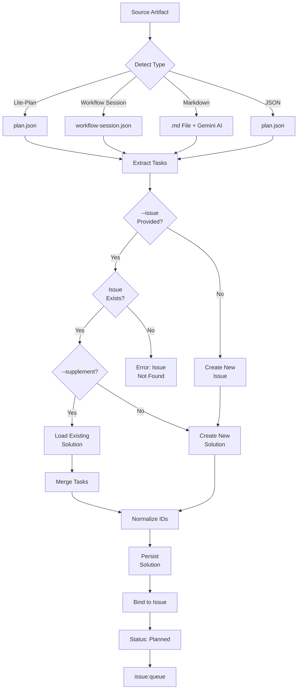

# issue:convert-to-plan

Converts various planning artifact formats (lite-plan, workflow session, markdown, JSON) into issue workflow solutions with intelligent detection and automatic binding.

## Description

The `issue:convert-to-plan` command bridges external planning workflows with the issue system. It auto-detects source formats, extracts task structures, normalizes to solution schema, and either creates new issues or supplements existing solutions.

### Key Features

- **Multi-format support**: lite-plan, workflow sessions, markdown, JSON
- **Auto-detection**: Identifies source type automatically
- **AI-assisted extraction**: Gemini CLI for markdown parsing
- **Supplement mode**: Add tasks to existing solutions
- **Auto-binding**: Solutions automatically bound to issues
- **Issue auto-creation**: Creates issues from plans when needed

## Usage

```bash
# Convert lite-plan to new issue (auto-creates issue)
/issue:convert-to-plan ".workflow/.lite-plan/implement-auth-2026-01-25"

# Convert workflow session to existing issue
/issue:convert-to-plan WFS-auth-impl --issue GH-123

# Convert markdown file to issue
/issue:convert-to-plan "./docs/implementation-plan.md"

# Supplement existing solution with additional tasks
/issue:convert-to-plan "./docs/additional-tasks.md" --issue ISS-001 --supplement

# Auto mode - skip confirmations
/issue:convert-to-plan ".workflow/.lite-plan/my-plan" -y
```

### Arguments

| Argument | Required | Description |
|----------|----------|-------------|
| `SOURCE` | Yes | Planning artifact path or WFS-xxx ID |
| `--issue &lt;id&gt;` | No | Bind to existing issue instead of creating new |
| `--supplement` | No | Add tasks to existing solution (requires --issue) |
| `-y, --yes` | No | Skip all confirmations |

## Examples

### Convert Lite-Plan

```bash
/issue:convert-to-plan ".workflow/.lite-plan/implement-auth"
# Output:
# Detected source type: lite-plan
# Extracted: 5 tasks
# Created issue: ISS-20250129-001 (priority: 3)
# ✓ Created solution: SOL-ISS-20250129-001-a7b3
# ✓ Bound solution to issue
# → Status: planned
```

### Convert Workflow Session

```bash
/issue:convert-to-plan WFS-auth-impl --issue GH-123
# Output:
# Detected source type: workflow-session
# Loading session: .workflow/active/WFS-auth-impl/
# Extracted: 8 tasks from session
# ✓ Created solution: SOL-GH-123-c9d2
# ✓ Bound solution to issue GH-123
```

### Convert Markdown with AI

```bash
/issue:convert-to-plan "./docs/api-redesign.md"
# Output:
# Detected source type: markdown-file
# Using Gemini CLI for intelligent extraction...
# Extracted: 6 tasks
# Created issue: ISS-20250129-002 (priority: 2)
# ✓ Created solution: SOL-ISS-20250129-002-e4f1
```

### Supplement Existing Solution

```bash
/issue:convert-to-plan "./docs/tasks-phase2.md" --issue ISS-001 --supplement
# Output:
# Loaded existing solution: SOL-ISS-001-a7b3 (3 tasks)
# Extracted: 2 new tasks
# Supplementing: 3 existing + 2 new = 5 total tasks
# ✓ Updated solution: SOL-ISS-001-a7b3
```

## Issue Lifecycle Flow



## Supported Sources

### 1. Lite-Plan

**Location**: `.workflow/.lite-plan/&#123;slug&#125;/plan.json`

**Schema**:
```typescript
interface LitePlan {
  summary: string;
  approach: string;
  complexity: 'low' | 'medium' | 'high';
  estimated_time: string;
  tasks: LiteTask[];
  _metadata: {
    timestamp: string;
    exploration_angles: string[];
  };
}

interface LiteTask {
  id: string;
  title: string;
  scope: string;
  action: string;
  description: string;
  modification_points: Array<{file, target, change}>;
  implementation: string[];
  acceptance: string[];
  depends_on: string[];
}
```

### 2. Workflow Session

**Location**: `.workflow/active/&#123;session&#125;/` or `WFS-xxx` ID

**Files**:
- `workflow-session.json` - Session metadata
- `IMPL_PLAN.md` - Implementation plan (optional)
- `.task/IMPL-*.json` - Task definitions

**Extraction**:
```typescript
// From workflow-session.json
{
  title: session.name,
  description: session.description,
  session_id: session.id
}

// From IMPL_PLAN.md
approach: Extract overview section

// From .task/IMPL-*.json
tasks: Map IMPL-001 → T1, IMPL-002 → T2...
```

### 3. Markdown File

**Any `.md` file with implementation/task content**

**AI Extraction** (via Gemini CLI):
```javascript
// Prompt Gemini to extract structure
{
  title: "Extracted from document",
  approach: "Technical strategy section",
  tasks: [
    {
      id: "T1",
      title: "Parsed from headers/lists",
      scope: "inferred from content",
      action: "detected from verbs",
      implementation: ["step 1", "step 2"],
      acceptance: ["criteria 1", "criteria 2"]
    }
  ]
}
```

### 4. JSON File

**Direct JSON matching plan-json-schema**

```typescript
interface JSONPlan {
  summary?: string;
  title?: string;
  description?: string;
  approach?: string;
  complexity?: 'low' | 'medium' | 'high';
  tasks: JSONTask[];
  _metadata?: object;
}
```

## Task Normalization

### ID Normalization

```javascript
// Various input formats → T1, T2, T3...
"IMPL-001" → "T1"
"IMPL-01" → "T1"
"task-1" → "T1"
"1" → "T1"
"T-1" → "T1"
```

### Depends-On Normalization

```javascript
// Normalize all references to T-format
depends_on: ["IMPL-001", "task-2"]
// → ["T1", "T2"]
```

### Action Validation

```javascript
// Valid actions (case-insensitive, auto-capitalized)
['Create', 'Update', 'Implement', 'Refactor',
 'Add', 'Delete', 'Configure', 'Test', 'Fix']

// Invalid actions → Default to 'Implement'
'build' → 'Implement'
'write' → 'Create'
```

## Solution Schema

Target format for all extracted data:

```typescript
interface Solution {
  id: string;                    // SOL-{issue-id}-{4-char-uid}
  description?: string;          // High-level summary
  approach?: string;             // Technical strategy
  tasks: Task[];                 // Required: at least 1 task
  exploration_context?: object;  // Optional: source context
  analysis?: {
    risk: 'low' | 'medium' | 'high';
    impact: 'low' | 'medium' | 'high';
    complexity: 'low' | 'medium' | 'high';
  };
  score?: number;                // 0.0-1.0
  is_bound: boolean;
  created_at: string;
  bound_at?: string;
  _conversion_metadata?: {
    source_type: string;
    source_path: string;
    converted_at: string;
  };
}

interface Task {
  id: string;                    // T1, T2, T3...
  title: string;                 // Required: action verb + target
  scope: string;                 // Required: module path or feature area
  action: Action;                // Required: Create|Update|Implement...
  description?: string;
  modification_points?: Array<{file, target, change}>;
  implementation: string[];      // Required: step-by-step guide
  test?: {
    unit?: string[];
    integration?: string[];
    commands?: string[];
    coverage_target?: string;
  };
  acceptance: {
    criteria: string[];
    verification: string[];
  };
  commit?: {
    type: string;
    scope: string;
    message_template: string;
    breaking?: boolean;
  };
  depends_on?: string[];
  priority?: number;             // 1-5 (default: 3)
}

type Action = 'Create' | 'Update' | 'Implement' | 'Refactor' |
             'Add' | 'Delete' | 'Configure' | 'Test' | 'Fix';
```

## Priority Auto-Detection

For new issues created from plans:

```javascript
const complexityMap = {
  high: 2,    // High complexity → priority 2 (high)
  medium: 3,  // Medium complexity → priority 3 (medium)
  low: 4      // Low complexity → priority 4 (low)
};

// If no complexity specified, default to 3
const priority = complexityMap[plan.complexity?.toLowerCase()] || 3;
```

## Error Handling

| Error Code | Message | Resolution |
|------------|---------|------------|
| **E001** | Source not found: &#123;path&#125; | Check path exists and is accessible |
| **E002** | Unable to detect source format | Verify file contains valid plan structure |
| **E003** | Issue not found: &#123;id&#125; | Check issue ID or omit --issue to create new |
| **E004** | Issue already has bound solution | Use --supplement to add tasks |
| **E005** | Failed to extract tasks from markdown | Check markdown structure, try simpler format |
| **E006** | No tasks extracted from source | Source must contain at least 1 task |

## CLI Endpoints

```bash
# Create new issue
ccw issue create << 'EOF'
{"title":"...","context":"...","priority":3,"source":"converted"}
EOF

# Check issue exists
ccw issue status &lt;id&gt; --json

# Get existing solution
ccw issue solution &lt;solution-id&gt; --json

# Bind solution to issue
ccw issue bind &lt;issue-id&gt; &lt;solution-id&gt;

# Update issue status
ccw issue update &lt;issue-id&gt; --status planned
```

## Related Commands

- **[issue:plan](./issue-plan.md)** - Generate solutions from issue exploration
- **[issue:new](./issue-new.md)** - Create issues from GitHub or text
- **[issue:queue](./issue-queue.md)** - Form execution queue from converted plans
- **[issue:execute](./issue-execute.md)** - Execute converted solutions
- **[workflow:lite-lite-lite](#)** - Generate lite-plan artifacts
- **[workflow:execute](#)** - Generate workflow sessions

## Best Practices

1. **Verify source format**: Ensure plan has valid structure before conversion
2. **Check for existing solutions**: Use --supplement to add tasks, not replace
3. **Review extracted tasks**: Verify AI extraction accuracy for markdown
4. **Normalize manually**: Edit task IDs and dependencies if needed
5. **Test in supplement mode**: Add tasks to existing solution before creating new issue
6. **Keep source artifacts**: Don't delete original plan files after conversion
