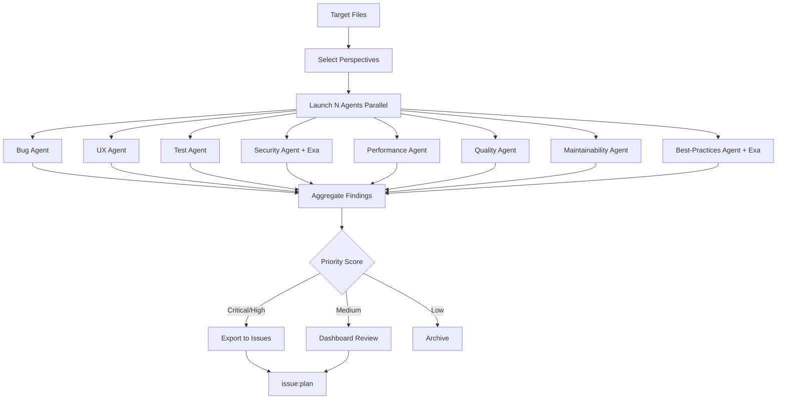

# issue:discover

Multi-perspective issue discovery orchestrator that explores code from different angles to identify potential bugs, UX improvements, test gaps, and other actionable items.

## Description

The `issue:discover` command analyzes code from 8 specialized perspectives (bug, UX, test, quality, security, performance, maintainability, best-practices) using parallel CLI agents. It aggregates findings and can export high-priority discoveries as issues.

### Key Features

- **8 analysis perspectives**: Specialized analysis for different concern areas
- **Parallel execution**: Multiple agents run simultaneously for speed
- **External research**: Exa integration for security and best-practices benchmarking
- **Dashboard integration**: View and filter findings via CCW dashboard
- **Smart prioritization**: Automated severity scoring and deduplication
- **Direct export**: Convert findings to issues with one click

## Usage

```bash
# Interactive perspective selection
/issue:discover src/auth/**

# Specific perspectives
/issue:discover src/payment/** --perspectives=bug,security,test

# With external research
/issue:discover src/api/** --external

# Auto mode - all perspectives
/issue:discover src/** --yes

# Multiple modules
/issue:discover src/auth/**,src/payment/**
```

### Arguments

| Argument | Required | Description |
|----------|----------|-------------|
| `path-pattern` | Yes | Glob pattern for files to analyze |
| `--perspectives` | No | Comma-separated list (default: interactive) |
| `--external` | No | Enable Exa external research |
| `-y, --yes` | No | Auto-select all perspectives |

## Perspectives

### Available Analysis Types

| Perspective | Focus Areas | Categories |
|-------------|-------------|------------|
| **bug** | Edge cases, null checks, resource leaks | edge-case, null-check, race-condition, boundary |
| **ux** | User experience issues | error-message, loading-state, accessibility, feedback |
| **test** | Test coverage gaps | missing-test, edge-case-test, integration-gap |
| **quality** | Code quality issues | complexity, duplication, naming, code-smell |
| **security** | Security vulnerabilities | injection, auth, encryption, input-validation |
| **performance** | Performance bottlenecks | n-plus-one, memory-usage, caching, algorithm |
| **maintainability** | Code maintainability | coupling, cohesion, tech-debt, module-boundary |
| **best-practices** | Industry best practices | convention, pattern, framework-usage |

## Examples

### Quick Scan (Recommended)

```bash
/issue:discover src/auth/**
# Interactive prompt:
#   Select primary discovery focus:
#   [1] Bug + Test + Quality (Recommended)
#   [2] Security + Performance
#   [3] Maintainability + Best-practices
#   [4] Full analysis
```

### Security Audit with External Research

```bash
/issue:discover src/payment/** --perspectives=security --external
# Uses Exa to research OWASP payment security standards
# Compares implementation against industry benchmarks
```

### Full Analysis with Auto Mode

```bash
/issue:discover src/api/** --yes
# Runs all 8 perspectives in parallel
# No confirmations, processes all findings
```

## Issue Lifecycle Flow



## Discovery Output Structure

### Directory Layout

```
.workflow/issues/discoveries/
├── {discovery-id}/
│   ├── discovery-state.json          # Session state machine
│   ├── perspectives/
│   │   ├── bug.json                  # Bug findings
│   │   ├── ux.json                   # UX findings
│   │   ├── security.json             # Security findings
│   │   └── ...
│   ├── external-research.json        # Exa results (if enabled)
│   ├── discovery-issues.jsonl        # Exported candidate issues
│   └── summary.md                    # Consolidated report
```

### Finding Schema

```typescript
interface DiscoveryFinding {
  id: string;
  perspective: string;
  title: string;
  priority: 'critical' | 'high' | 'medium' | 'low';
  category: string;
  description: string;
  file: string;
  line: number;
  snippet: string;
  suggested_issue: string;
  confidence: number;
  priority_score: number;
}
```

## Priority Categories

### Critical (Automatic Export)

- Data corruption risks
- Security vulnerabilities (auth bypass, injection)
- Memory leaks
- Race conditions
- Critical accessibility issues

### High (Recommended Export)

- Missing core functionality tests
- Significant UX confusion
- N+1 query problems
- Clear security gaps
- Major code smells

### Medium (Dashboard Review)

- Edge case gaps
- Inconsistent patterns
- Minor performance issues
- Documentation gaps
- Style violations

### Low (Informational)

- Cosmetic issues
- Minor naming inconsistencies
- Optimization opportunities
- Nice-to-have improvements

## Dashboard Integration

### Viewing Discoveries

```bash
# Open CCW dashboard
ccw view

# Navigate to: Issues > Discovery
```

**Features**:
- View all discovery sessions
- Filter by perspective and priority
- Preview finding details with code snippets
- Bulk select findings for export
- Compare findings across sessions

### Exporting to Issues

From the dashboard:
1. Select findings to export
2. Click "Export as Issues"
3. Findings are converted to standard issue format
4. Appended to `.workflow/issues/issues.jsonl`
5. Status set to `registered`
6. Continue with `/issue:plan` workflow

## Exa External Research

### Security Perspective

Researches:
- OWASP Top 10 for your technology stack
- Industry-standard security patterns
- Common vulnerabilities in your framework
- Best practices for your specific use case

### Best-Practices Perspective

Researches:
- Framework-specific conventions
- Language idioms and patterns
- Deprecated API warnings
- Community-recommended approaches

## Related Commands

- **[issue:new](./issue-new.md)** - Create issues from discoveries
- **[issue:plan](./issue-plan.md)** - Plan solutions for discovered issues
- **[issue:manage](#)** - Interactive issue management dashboard
- **[review-code](#)** - Code review for quality assessment

## Best Practices

1. **Start focused**: Begin with specific modules, not entire codebase
2. **Quick scan first**: Use bug+test+quality for fast results
3. **Review before export**: Not all findings warrant issues
4. **Enable Exa strategically**: For unfamiliar tech or security audits
5. **Combine perspectives**: Run related perspectives together (e.g., security+bug)
6. **Iterate**: Run discovery on changed modules after each sprint

## Comparison: Discovery vs Code Review

| Aspect | issue:discover | review-code |
|--------|----------------|-------------|
| **Purpose** | Find actionable issues | Assess code quality |
| **Output** | Exportable issues | Quality report |
| **Perspectives** | 8 specialized angles | 7 quality dimensions |
| **External Research** | Yes (Exa) | No |
| **Dashboard Integration** | Yes | No |
| **Use When** | Proactive issue hunting | Post-commit review |
