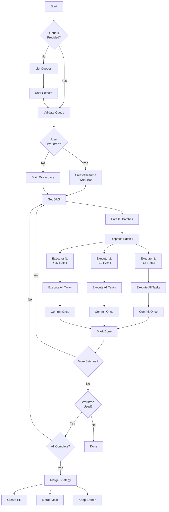

# issue:execute

Minimal orchestrator that dispatches solution IDs to executors. Each executor receives a complete solution with all tasks and commits once per solution.

## Description

The `issue:execute` command executes queued solutions using DAG-based parallel orchestration. Each executor receives a complete solution with all tasks, executes tasks sequentially, and commits once per solution. Supports optional git worktree isolation for clean workspace management.

### Key Features

- **DAG-based parallelism**: Automatic parallel execution of independent solutions
- **Solution-level execution**: Each executor handles all tasks in a solution
- **Single commit per solution**: Clean git history with formatted summaries
- **Worktree isolation**: Optional isolated workspace for queue execution
- **Multiple executors**: Codex, Gemini, or Agent support
- **Resume capability**: Recover from interruptions with existing worktree

## Usage

```bash
# Execute specific queue (REQUIRED)
/issue:execute --queue QUE-xxx

# Execute in isolated worktree
/issue:execute --queue QUE-xxx --worktree

# Resume in existing worktree
/issue:execute --queue QUE-xxx --worktree /path/to/worktree

# Dry-run (show DAG without executing)
/issue:execute --queue QUE-xxx
# Select: Dry-run mode
```

### Arguments

| Argument | Required | Description |
|----------|----------|-------------|
| `--queue &lt;id&gt;` | Yes | Queue ID to execute (required) |
| `--worktree` | No | Create isolated worktree for execution |
| `--worktree &lt;path&gt;` | No | Resume in existing worktree |

### Executor Selection

Interactive prompt selects:
- **Codex** (Recommended): Autonomous coding with 2hr timeout
- **Gemini**: Large context analysis and implementation
- **Agent**: Claude Code sub-agent for complex tasks

## Examples

### Execute Queue (Interactive)

```bash
/issue:execute --queue QUE-20251227-143000
# Output:
# ## Executing Queue: QUE-20251227-143000
# ## Queue DAG (Solution-Level)
# - Total Solutions: 5
# - Ready: 2
# - Completed: 0
# - Parallel in batch 1: 2
#
# Select executor:
#   [1] Codex (Recommended)
#   [2] Gemini
#   [3] Agent
# Select mode:
#   [1] Execute (Recommended)
#   [2] Dry-run
# Use git worktree?
#   [1] Yes (Recommended)
#   [2] No
```

### Queue ID Not Provided

```bash
/issue:execute
# Output:
# Available Queues:
# ID                    Status      Progress    Issues
# -----------------------------------------------------------
# → QUE-20251215-001   active      3/10        ISS-001, ISS-002
#   QUE-20251210-002   active      0/5         ISS-003
#   QUE-20251205-003   completed   8/8         ISS-004
#
# Which queue would you like to execute?
#   [1] QUE-20251215-001 - 3/10 completed, Issues: ISS-001, ISS-002
#   [2] QUE-20251210-002 - 0/5 completed, Issues: ISS-003
```

### Execute with Worktree

```bash
/issue:execute --queue QUE-xxx --worktree
# Output:
# Created queue worktree: /repo/.ccw/worktrees/queue-exec-QUE-xxx
# Branch: queue-exec-QUE-xxx
# ### Executing Solutions (DAG batch 1): S-1, S-2
# [S-1] Executor launched (codex, 2hr timeout)
# [S-2] Executor launched (codex, 2hr timeout)
# ✓ S-1 completed: 3 tasks, 1 commit
# ✓ S-2 completed: 2 tasks, 1 commit
```

### Resume Existing Worktree

```bash
# Find existing worktrees
git worktree list
# /repo/.ccw/worktrees/queue-exec-QUE-123

# Resume execution
/issue:execute --queue QUE-123 --worktree /repo/.ccw/worktrees/queue-exec-QUE-123
# Output:
# Resuming in existing worktree: /repo/.ccw/worktrees/queue-exec-QUE-123
# Branch: queue-exec-QUE-123
# ### Executing Solutions (DAG batch 2): S-3
```

## Issue Lifecycle Flow



## Execution Model

### DAG-Based Batching

```
Batch 1 (Parallel): S-1, S-2  → No file conflicts
Batch 2 (Parallel): S-3, S-4  → No conflicts, waits for Batch 1
Batch 3 (Sequential): S-5     → Depends on S-3
```

### Solution Execution (Within Executor)

```
ccw issue detail S-1  → Get full solution with all tasks
↓
For each task T1, T2, T3...:
  - Follow implementation steps
  - Run test commands
  - Verify acceptance criteria
↓
After ALL tasks pass:
  git commit -m "feat(scope): summary

  Solution: S-1
  Tasks completed: T1, T2, T3

  Changes:
  - file1: what changed
  - file2: what changed

  Verified: all tests passed"
↓
ccw issue done S-1 --result '{summary, files, commit}'
```

## Executor Dispatch

### Codex Executor

```bash
ccw cli -p "## Execute Solution: S-1
..." --tool codex --mode write --id exec-S-1
# Timeout: 2 hours (7200000ms)
# Background: true
```

### Gemini Executor

```bash
ccw cli -p "## Execute Solution: S-1
..." --tool gemini --mode write --id exec-S-1
# Timeout: 1 hour (3600000ms)
# Background: true
```

### Agent Executor

```javascript
Task({
  subagent_type: 'code-developer',
  run_in_background: false,
  description: 'Execute solution S-1',
  prompt: '...'  // Full execution prompt
})
```

## Worktree Management

### Create New Worktree

```bash
# One worktree for entire queue execution
git worktree add .ccw/worktrees/queue-exec-QUE-xxx -b queue-exec-QUE-xxx
# All solutions execute in this isolated workspace
# Main workspace remains untouched
```

### Resume Existing Worktree

```bash
# Find interrupted executions
git worktree list
# Output:
# /repo/.ccw/worktrees/queue-exec-QUE-123    abc1234 [queue-exec-QUE-123]

# Resume with worktree path
/issue:execute --queue QUE-123 --worktree /repo/.ccw/worktrees/queue-exec-QUE-123
```

### Worktree Completion

After all batches complete:

```bash
# Prompt for merge strategy
Queue complete. What to do with worktree branch "queue-exec-QUE-xxx"?
  [1] Create PR (Recommended)
  [2] Merge to main
  [3] Keep branch

# Create PR
git push -u origin queue-exec-QUE-xxx
gh pr create --title "Queue QUE-xxx" --body "Issue queue execution"
git worktree remove .ccw/worktrees/queue-exec-QUE-xxx

# OR Merge to main
git merge --no-ff queue-exec-QUE-xxx -m "Merge queue QUE-xxx"
git branch -d queue-exec-QUE-xxx
git worktree remove .ccw/worktrees/queue-exec-QUE-xxx
```

## CLI Endpoints

### Queue Operations

```bash
# List queues
ccw issue queue list --brief --json

# Get DAG
ccw issue queue dag --queue QUE-xxx
# Returns: {parallel_batches: [["S-1","S-2"], ["S-3"]]}
```

### Solution Operations

```bash
# Get solution details (READ-ONLY)
ccw issue detail S-1
# Returns: Full solution with all tasks

# Mark solution complete
ccw issue done S-1 --result '{"summary":"...","files_modified":[...],"commit":{...},"tasks_completed":3}'

# Mark solution failed
ccw issue done S-1 --fail --reason '{"task_id":"T2","error_type":"test_failure","message":"..."}'
```

## Commit Message Format

```bash
feat(auth): implement OAuth2 login flow

Solution: S-1
Tasks completed: T1, T2, T3

Changes:
- src/auth/oauth.ts: Implemented OAuth2 flow
- src/auth/login.ts: Integrated OAuth with existing login
- tests/auth/oauth.test.ts: Added comprehensive tests

Verified: all tests passed
```

**Commit Types**:
- `feat`: New feature
- `fix`: Bug fix
- `refactor`: Code refactoring
- `docs`: Documentation
- `test`: Test updates
- `chore`: Maintenance tasks

## Related Commands

- **[issue:queue](./issue-queue.md)** - Form execution queue before executing
- **[issue:plan](./issue-plan.md)** - Plan solutions before queuing
- **ccw issue retry** - Reset failed solutions for retry
- **ccw issue queue dag** - View dependency graph
- **ccw issue detail &lt;id&gt;** - View solution details

## Best Practices

1. **Use Codex executor**: Best for long-running autonomous work
2. **Enable worktree**: Keeps main workspace clean during execution
3. **Check DAG first**: Use dry-run to see execution plan
4. **Monitor progress**: Executors run in background, check completion
5. **Resume on failure**: Use existing worktree path to continue
6. **Review commits**: Each solution produces one formatted commit

## Troubleshooting

| Error | Cause | Resolution |
|-------|-------|------------|
| No queue specified | --queue argument missing | List queues and select one |
| No ready solutions | Dependencies blocked | Check DAG for blocking issues |
| Executor timeout | Solution too complex | Break into smaller solutions |
| Worktree exists | Previous incomplete execution | Resume with --worktree &lt;path&gt; |
| Partial task failure | Task reports failure | Check ccw issue done --fail output |
| Git conflicts | Parallel executors touched same files | DAG should prevent this |
