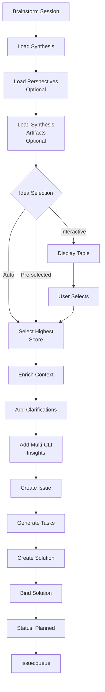

# issue:from-brainstorm

Bridge command that converts brainstorm-with-file session output into executable issue + solution for parallel-dev-cycle consumption.

## Description

The `issue:from-brainstorm` command converts brainstorm session ideas into structured issues with executable solutions. It loads synthesis results, selects ideas, enriches context with multi-CLI perspectives, and generates task-based solutions ready for execution.

### Key Features

- **Idea selection**: Interactive or automatic (highest-scored) selection
- **Context enrichment**: Adds clarifications and multi-perspective insights
- **Auto task generation**: Creates structured tasks from idea next_steps
- **Priority calculation**: Derives priority from idea score (0-10 → 1-5)
- **Direct binding**: Solution automatically bound to issue
- **Session metadata**: Preserves brainstorm origin in issue

## Usage

```bash
# Interactive mode - select idea from table
/issue:from-brainstorm SESSION="BS-rate-limiting-2025-01-28"

# Auto mode - select highest-scored idea
/issue:from-brainstorm SESSION="BS-caching-2025-01-28" --auto

# Pre-select idea by index
/issue:from-brainstorm SESSION="BS-auth-system-2025-01-28" --idea=0

# Auto mode with skip confirmations
/issue:from-brainstorm SESSION="BS-caching-2025-01-28" --auto -y
```

### Arguments

| Argument | Required | Description |
|----------|----------|-------------|
| `SESSION` | Yes | Session ID or path to `.workflow/.brainstorm/BS-xxx` |
| `--idea <index>` | No | Pre-select idea by index (0-based) |
| `--auto` | No | Auto-select highest-scored idea |
| `-y, --yes` | No | Skip all confirmations |

## Examples

### Interactive Mode

```bash
/issue:from-brainstorm SESSION="BS-rate-limiting-2025-01-28"
# Output:
# | # | Title | Score | Feasibility |
# |---|-------|-------|-------------|
# | 0 | Token Bucket Algorithm | 8.5 | High |
# | 1 | Sliding Window Counter | 7.2 | Medium |
# | 2 | Fixed Window | 6.1 | High |
#
# Select idea: #0
#
# ✓ Created issue: ISS-20250128-001
# ✓ Created solution: SOL-ISS-20250128-001-ab3d
# ✓ Bound solution to issue
# → Status: planned
# → Next: /issue:queue
```

### Auto Mode

```bash
/issue:from-brainstorm SESSION="BS-caching-2025-01-28" --auto
# Output:
# Auto-selected: Redis Cache Layer (Score: 9.2/10)
# ✓ Created issue: ISS-20250128-002
# ✓ Solution with 4 tasks:
#   - T1: Research & Validate Approach
#   - T2: Design & Create Specification
#   - T3: Implement Redis Cache Layer
#   - T4: Write Integration Tests
# → Status: planned
```

### Pre-select Idea

```bash
/issue:from-brainstorm SESSION="BS-auth-system-2025-01-28" --idea=1
# Skips selection, uses idea at index 1
```

## Issue Lifecycle Flow



## Session Files

### Input Files

```
.workflow/.brainstorm/BS-{slug}-{date}/
├── synthesis.json              # REQUIRED - Top ideas with scores
├── perspectives.json           # OPTIONAL - Multi-CLI insights
├── brainstorm.md              # Reference only
└── .brainstorming/            # OPTIONAL - Synthesis artifacts
    ├── system-architect/
    │   └── analysis.md        # Contains clarifications
    ├── api-designer/
    │   └── analysis.md
    └── ...
```

### Synthesis Schema

```typescript
interface Synthesis {
  session_id: string;
  topic: string;
  completed_at: string;
  top_ideas: Idea[];
}

interface Idea {
  index: number;
  title: string;
  description: string;
  score: number;                // 0-10
  novelty: number;              // 0-10
  feasibility: 'Low' | 'Medium' | 'High';
  key_strengths: string[];
  main_challenges: string[];
  next_steps: string[];
}
```

## Context Enrichment

### Base Context (Always Included)

```markdown
## Idea Description
{idea.description}

## Why This Idea
{idea.key_strengths}

## Challenges to Address
{idea.main_challenges}

## Implementation Steps
{idea.next_steps}
```

### Enhanced Context (If Available)

#### From Synthesis Artifacts

```markdown
## Requirements Clarification (system-architect)
Q: How will this integrate with existing auth?
A: Will use adapter pattern to wrap current system

## Architecture Feasibility (api-designer)
Q: What API changes are needed?
A: New /oauth/* endpoints, backward compatible
```

#### From Multi-CLI Perspectives

```markdown
## Creative Perspective
Insight: Consider gamification to improve adoption

## Pragmatic Perspective
Blocker: Current rate limiter lacks configuration

## Systematic Perspective
Pattern: Token bucket provides better burst handling
```

## Task Generation Strategy

### Task 1: Research & Validation

**Trigger**: `idea.main_challenges.length > 0`

```typescript
{
  id: "T1",
  title: "Research & Validate Approach",
  scope: "design",
  action: "Research",
  implementation: [
    "Investate identified blockers",
    "Review similar implementations in industry",
    "Validate approach with team/stakeholders"
  ],
  acceptance: {
    criteria: [
      "Blockers documented with resolution strategies",
      "Feasibility assessed with risk mitigation",
      "Approach validated with key stakeholders"
    ],
    verification: [
      "Research document created",
      "Stakeholder approval obtained",
      "Risk assessment completed"
    ]
  },
  priority: 1
}
```

### Task 2: Design & Specification

**Trigger**: `idea.key_strengths.length > 0`

```typescript
{
  id: "T2",
  title: "Design & Create Specification",
  scope: "design",
  action: "Design",
  implementation: [
    "Create detailed design document",
    "Define success metrics and KPIs",
    "Plan implementation phases"
  ],
  acceptance: {
    criteria: [
      "Design document complete with diagrams",
      "Success metrics defined and measurable",
      "Implementation plan with timeline"
    ],
    verification: [
      "Design reviewed and approved",
      "Metrics tracked in dashboard",
      "Phase milestones defined"
    ]
  },
  priority: 2
}
```

### Task 3+: Implementation Tasks

**Trigger**: `idea.next_steps[]`

Each next_step becomes a task:

```typescript
{
  id: "T3",
  title: "{next_steps[0]}",  // max 60 chars
  scope: inferScope(step),    // backend, frontend, infra...
  action: detectAction(step), // Implement, Create, Update...
  implementation: [
    "Execute: {next_steps[0]}",
    "Follow design specification",
    "Write unit and integration tests"
  ],
  acceptance: {
    criteria: [
      "Step implemented per design",
      "Tests passing with coverage >80%",
      "Code reviewed and approved"
    ],
    verification: [
      "Functional tests pass",
      "Code coverage meets threshold",
      "Review approved"
    ]
  },
  priority: 3
}
```

### Fallback Task

**Trigger**: No tasks generated from above

```typescript
{
  id: "T1",
  title: idea.title,
  scope: "implementation",
  action: "Implement",
  implementation: [
    "Analyze requirements and context",
    "Design solution approach",
    "Implement core functionality",
    "Write comprehensive tests",
    "Document changes and usage"
  ],
  acceptance: {
    criteria: [
      "Core functionality working",
      "Tests passing",
      "Documentation complete"
    ],
    verification: [
      "Manual testing successful",
      "Automated tests pass",
      "Docs reviewed"
    ]
  },
  priority: 3
}
```

## Priority Calculation

### Issue Priority

```javascript
// idea.score: 0-10 → priority: 1-5
priority = max(1, min(5, ceil((10 - score) / 2)))

Examples:
score 9-10 → priority 1 (critical)
score 7-8  → priority 2 (high)
score 5-6  → priority 3 (medium)
score 3-4  → priority 4 (low)
score 0-2  → priority 5 (lowest)
```

### Task Priority

- Research task: 1 (highest - validates approach)
- Design task: 2 (high - foundation for implementation)
- Implementation tasks: 3 by default
- Testing/documentation: 4-5 (lower priority)

## Output Structure

### Issue Created

```typescript
interface Issue {
  id: string;                    // ISS-YYYYMMDD-NNN
  title: string;                 // From idea.title
  status: 'planned';             // Auto-set after binding
  priority: number;              // Derived from score
  context: string;               // Enriched description
  source: 'brainstorm';
  labels: string[];              // ['brainstorm', perspective, feasibility]
  expected_behavior: string;     // From key_strengths
  actual_behavior: string;       // From main_challenges
  affected_components: string[]; // Extracted from description
  bound_solution_id: string;     // Auto-bound
  _brainstorm_metadata: {
    session_id: string;
    idea_score: number;
    novelty: number;
    feasibility: string;
    clarifications_count: number;
  };
}
```

### Solution Created

```typescript
interface Solution {
  id: string;                    // SOL-{issue-id}-{4-char-uid}
  description: string;           // idea.title
  approach: string;              // idea.description
  tasks: Task[];
  analysis: {
    risk: 'low' | 'medium' | 'high';
    impact: 'low' | 'medium' | 'high';
    complexity: 'low' | 'medium' | 'high';
  };
  is_bound: true;
  created_at: string;
  bound_at: string;
}
```

## Integration Flow

```
brainstorm-with-file
        │
        ├─ synthesis.json (top_ideas)
        ├─ perspectives.json (multi-CLI insights)
        └─ .brainstorming/** (synthesis artifacts)
        │
        ▼
issue:from-brainstorm ◄─── This command
        │
        ├─ ISS-YYYYMMDD-NNN (enriched issue)
        └─ SOL-{issue-id}-{uid} (structured solution)
        │
        ▼
issue:queue
        │
        ▼
issue:execute
        │
        ▼
   Complete Solution
```

## Related Commands

- **[workflow:brainstorm-with-file](#)** - Generate brainstorm sessions
- **[workflow:brainstorm:synthesis](#)** - Add clarifications to brainstorm
- **[issue:new](./issue-new.md)** - Create issues from GitHub or text
- **[issue:plan](./issue-plan.md)** - Plan solutions for issues
- **[issue:queue](./issue-queue.md)** - Form execution queue
- **[issue:execute](./issue-execute.md)** - Execute with parallel-dev-cycle

## CLI Endpoints

```bash
# Create issue
ccw issue create << 'EOF'
{
  "title": "...",
  "context": "...",
  "priority": 3,
  "source": "brainstorm",
  "labels": ["brainstorm", "creative", "feasibility-high"]
}
EOF

# Bind solution
ccw issue bind {issue-id} {solution-id}

# Update status
ccw issue update {issue-id} --status planned
```
