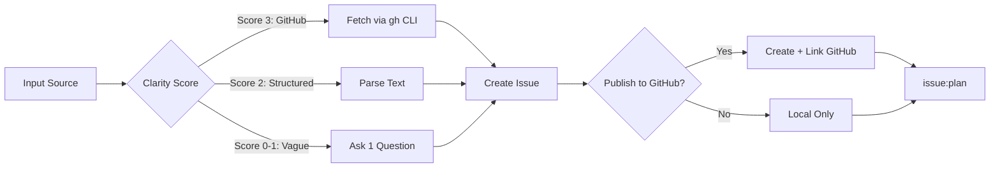
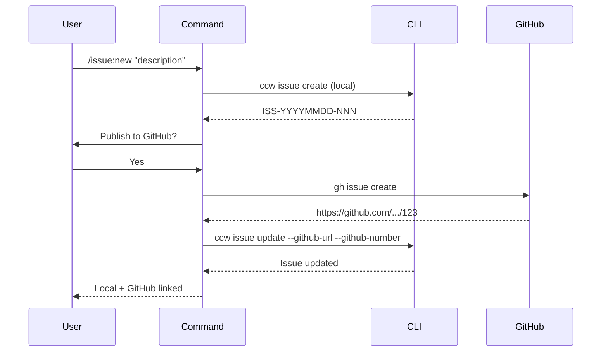

# issue:new

Create structured issues from GitHub URLs, text descriptions, or brainstorm sessions with automatic categorization and priority detection.

## Description

The `issue:new` command creates structured issues from multiple input sources with intelligent clarity detection. It asks clarifying questions only when needed and supports both local and GitHub-synced issues.

### Key Features

- **Multi-source input**: GitHub URLs, text descriptions, structured input
- **Clarity detection**: Asks questions only for vague inputs
- **GitHub integration**: Optional publishing to GitHub with bidirectional sync
- **Smart categorization**: Automatic tag and priority detection
- **ACE integration**: Lightweight codebase context for affected components

## Usage

```bash
# Clear inputs - direct creation (no questions)
/issue:new https://github.com/owner/repo/issues/123
/issue:new "Login fails with special chars. Expected: success. Actual: 500"

# Vague input - will ask 1 clarifying question
/issue:new "something wrong with auth"

# With priority override
/issue:new "Database connection times out" --priority 2

# Auto mode - skip confirmations
/issue:new "Fix navigation bug" -y
```

### Arguments

| Argument | Required | Description |
|----------|----------|-------------|
| `input` | Yes | GitHub URL, issue description, or structured text |
| `-y, --yes` | No | Skip confirmation questions |
| `--priority <1-5>` | No | Override priority (1=critical, 5=low) |

## Examples

### Create from GitHub URL

```bash
/issue:new https://github.com/owner/repo/issues/42
# Output: Fetches issue details via gh CLI, creates immediately
```

### Create with Structured Text

```bash
/issue:new "Login fails with special chars. Expected: success. Actual: 500 error"
# Output: Parses structure, creates issue with extracted fields
```

### Create with Clarification

```bash
/issue:new "auth broken"
# System asks: "Please describe the issue in more detail:"
# User provides: "Users cannot log in when password contains quotes"
# Issue created with enriched context
```

### Create with GitHub Publishing

```bash
/issue:new "Memory leak in WebSocket handler"
# System asks: "Would you like to publish to GitHub?"
# User selects: "Yes, publish to GitHub"
# Output:
#   Local issue: ISS-20251229-001
#   GitHub issue: https://github.com/org/repo/issues/123
#   Both linked bidirectionally
```

## Issue Lifecycle Flow



## Issue Fields

### Core Fields

| Field | Type | Description |
|-------|------|-------------|
| `id` | string | Issue ID (`GH-123` or `ISS-YYYYMMDD-NNN`) |
| `title` | string | Issue title (max 60 chars) |
| `status` | enum | `registered` | `planned` | `queued` | `in_progress` | `completed` | `failed` |
| `priority` | number | 1 (critical) to 5 (low) |
| `context` | string | Problem description (single source of truth) |
| `source` | enum | `github` | `text` | `discovery` | `brainstorm` | `converted` |

### Optional Fields

| Field | Type | Description |
|-------|------|-------------|
| `source_url` | string | Original source URL |
| `labels` | string[] | Category tags |
| `expected_behavior` | string | Expected system behavior |
| `actual_behavior` | string | Actual problematic behavior |
| `affected_components` | string[] | Related files/modules (via ACE) |
| `github_url` | string | Linked GitHub issue URL |
| `github_number` | number | GitHub issue number |
| `feedback` | object[] | Failure history and clarifications |

### Feedback Schema

```typescript
interface Feedback {
  type: 'failure' | 'clarification' | 'rejection';
  stage: 'new' | 'plan' | 'execute';
  content: string;
  created_at: string;
}
```

## Clarity Detection

### Scoring Rules

| Score | Criteria | Behavior |
|-------|----------|----------|
| **3** | GitHub URL | Fetch directly, no questions |
| **2** | Structured text (has "expected:", "actual:", etc.) | Parse structure, may use ACE for components |
| **1** | Long text (>50 chars) | Quick ACE hint if components missing |
| **0** | Vague/short text | Ask 1 clarifying question |

### Structured Text Patterns

The command recognizes these keywords for automatic parsing:
- `expected:` / `Expected:`
- `actual:` / `Actual:`
- `affects:` / `Affects:`
- `steps:` / `Steps:`

## GitHub Publishing Workflow



## Related Commands

- **[issue:plan](./issue-plan.md)** - Generate solution for issue
- **[issue:queue](./issue-queue.md)** - Form execution queue
- **[issue:discover](./issue-discover.md)** - Discover issues from codebase
- **[issue:from-brainstorm](./issue-from-brainstorm.md)** - Convert brainstorm to issue
- **[issue:convert-to-plan](./issue-convert-to-plan.md)** - Convert plans to issues
- **[issue:execute](./issue-execute.md)** - Execute issue queue

## CLI Endpoints

The command uses these CLI endpoints:

```bash
# Create issue
echo '{"title":"...","context":"...","priority":3}' | ccw issue create

# Update with GitHub binding
ccw issue update <id> --github-url "<url>" --github-number <num>

# View issue
ccw issue status <id> --json
```
