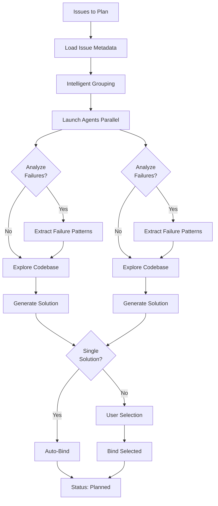

# issue:plan

Batch plan issue resolution using intelligent agent-driven exploration and planning with failure-aware retry logic.

## Description

The `issue:plan` command uses the issue-plan-agent to combine exploration and planning into a single closed-loop workflow. It generates executable solutions with task breakdowns, handles previous failure analysis, and supports batch processing of up to 3 issues per agent.

### Key Features

- **Explore + Plan**: Combined workflow for faster planning
- **Failure-aware**: Analyzes previous failures to avoid repeats
- **Batch processing**: Groups semantically similar issues
- **Auto-binding**: Single solutions automatically bound
- **Conflict detection**: Identifies cross-issue file conflicts
- **GitHub integration**: Adds GitHub comment tasks when applicable

## Usage

```bash
# Plan all pending issues (default)
/issue:plan

# Plan specific issues
/issue:plan GH-123,GH-124,GH-125

# Plan single issue
/issue:plan ISS-20251229-001

# Explicit all-pending
/issue:plan --all-pending

# Custom batch size
/issue:plan --batch-size 5
```

### Arguments

| Argument | Required | Description |
|----------|----------|-------------|
| `issue-ids` | No | Comma-separated issue IDs (default: all pending) |
| `--all-pending` | No | Explicit flag for all pending issues |
| `--batch-size <n>` | No | Max issues per batch (default: 3) |
| `-y, --yes` | No | Auto-bind without confirmation |

## Examples

### Plan All Pending Issues

```bash
/issue:plan
# Output:
# Found 5 pending issues
# Processing 5 issues in 2 batch(es)
# [Batch 1/2] Planning GH-123, GH-124, GH-125...
# ✓ GH-123: SOL-GH-123-a7x9 (3 tasks)
# ✓ GH-124: SOL-GH-124-b3m2 (4 tasks)
# ✓ GH-125: SOL-GH-125-c8k1 (2 tasks)
```

### Plan with Failure Retry

```bash
/issue:plan ISS-20251229-001
# Agent analyzes previous failure from issue.feedback
# Avoids same approach that failed before
# Creates alternative solution with verification steps
```

### Multiple Solutions Selection

```bash
/issue:plan GH-999
# Agent generates 2 alternative solutions
# Interactive prompt:
#   Issue GH-999: which solution to bind?
#   [1] SOL-GH-999-a1b2 (4 tasks) - Refactor approach
#   [2] SOL-GH-999-c3d4 (6 tasks) - Rewrite approach
```

## Issue Lifecycle Flow



## Planning Workflow

### Phase 1: Issue Loading

```bash
# Brief metadata only (to avoid context overflow)
ccw issue list --status pending,registered --json
```

**Returns**: Array of `{id, title, tags}`

### Phase 2: Agent Exploration (Parallel)

Each agent performs:

1. **Fetch full issue details**
   ```bash
   ccw issue status <id> --json
   ```

2. **Analyze failure history** (if exists)
   - Extract `issue.feedback` where `type='failure'`, `stage='execute'`
   - Parse error_type, message, task_id, solution_id
   - Identify repeated patterns and root causes
   - Design alternative approach

3. **Load project context**
   - `.workflow/project-tech.json` (technology stack)
   - `.workflow/project-guidelines.json` (constraints)

4. **Explore codebase** (ACE semantic search)

5. **Generate solution** (following solution-schema.json)
   - Tasks with quantified acceptance criteria
   - Verification steps to prevent same failure
   - Reference to previous failures in approach

6. **Write and bind**
   - Write to `solutions/{issue-id}.jsonl`
   - Execute `ccw issue bind <issue-id> <solution-id>` if single solution

### Phase 3: Solution Selection

Multiple solutions → User selects via AskUserQuestion

### Phase 4: Summary

```bash
## Done: 5 issues → 5 planned

Bound Solutions:
- GH-123: SOL-GH-123-a7x9 (3 tasks)
- GH-124: SOL-GH-124-b3m2 (4 tasks)
- ISS-20251229-001: SOL-ISS-20251229-001-c8k1 (2 tasks)

Next: /issue:queue
```

## Failure-Aware Planning

### Feedback Schema

```typescript
interface FailureFeedback {
  type: 'failure';
  stage: 'execute';
  content: {
    task_id: string;
    solution_id: string;
    error_type: 'test_failure' | 'compilation' | 'timeout' | 'runtime_error';
    message: string;
    timestamp: string;
  };
  created_at: string;
}
```

### Failure Analysis Rules

1. **Extract patterns**: Repeated errors indicate systemic issues
2. **Identify root cause**: Test failure vs. compilation vs. timeout
3. **Design alternative**: Change approach, not just implementation
4. **Add prevention**: Explicit verification steps for same error
5. **Document lessons**: Reference failures in solution.approach

## CLI Endpoints

### Issue Operations

```bash
# List pending issues (brief)
ccw issue list --status pending --brief

# Get full issue details (agent use)
ccw issue status <id> --json

# Bind solution to issue
ccw issue bind <issue-id> <solution-id>

# List with bound solutions
ccw issue solutions --status planned --brief
```

### Solution Schema

```typescript
interface Solution {
  id: string;                    // SOL-{issue-id}-{4-char-uid}
  description: string;
  approach: string;
  tasks: Task[];
  exploration_context: {
    relevant_files: string[];
    dependencies: string[];
    patterns: string[];
  };
  failure_analysis?: {
    previous_failures: string[];
    alternative_approach: string;
    prevention_steps: string[];
  };
  is_bound: boolean;
  created_at: string;
  bound_at?: string;
}

interface Task {
  id: string;                    // T1, T2, T3...
  title: string;
  scope: string;
  action: string;
  implementation: string[];
  acceptance: {
    criteria: string[];
    verification: string[];
  };
  test?: {
    unit?: string[];
    integration?: string[];
    commands?: string[];
  };
}
```

## Related Commands

- **[issue:new](./issue-new.md)** - Create issues before planning
- **[issue:queue](./issue-queue.md)** - Form execution queue from planned issues
- **[issue:execute](./issue-execute.md)** - Execute planned solutions
- **[issue:from-brainstorm](./issue-from-brainstorm.md)** - Convert brainstorm to planned issue
- **[issue:convert-to-plan](./issue-convert-to-plan.md)** - Convert existing plans to issues

## Best Practices

1. **Plan in batches**: Default 3 issues per batch for optimal performance
2. **Review failures**: Check issue feedback before replanning
3. **Verify conflicts**: Agent reports file conflicts across issues
4. **GitHub issues**: Agent adds final task to comment on GitHub issue
5. **Acceptance criteria**: Ensure tasks have quantified success metrics
6. **Test coverage**: Each task should include verification steps

## Troubleshooting

| Error | Cause | Resolution |
|-------|-------|------------|
| No pending issues | All issues already planned | Create new issues or use --all-pending flag |
| Agent timeout | Large codebase exploration | Reduce batch size or limit scope |
| No solutions generated | Insufficient context | Provide more detailed issue description |
| Solution conflicts | Multiple issues touch same files | Agent reports conflicts, resolve manually |
| Bind failure | Solution file write error | Check permissions, retry |
