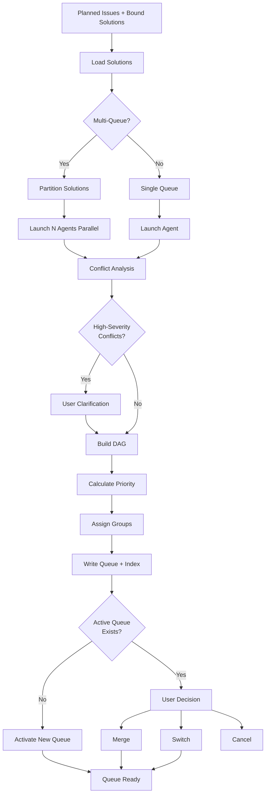

# issue:queue

Queue formation command using issue-queue-agent that analyzes bound solutions, resolves inter-solution conflicts, and creates an ordered execution queue.

## Description

The `issue:queue` command creates execution queues from planned issues with bound solutions. It performs solution-level conflict analysis, builds dependency DAGs, calculates semantic priority, and assigns execution groups (parallel/sequential).

### Key Features

- **Solution-level granularity**: Queue items are complete solutions, not individual tasks
- **Conflict resolution**: Automatic detection and user clarification for high-severity conflicts
- **Multi-queue support**: Create parallel queues for distributed execution
- **Semantic priority**: Intelligent ordering based on issue priority and task complexity
- **DAG-based grouping**: Parallel (P*) and Sequential (S*) execution groups
- **Queue history**: Track all queues with active queue management

## Usage

```bash
# Form new queue from all bound solutions
/issue:queue

# Form 3 parallel queues (solutions distributed)
/issue:queue --queues 3

# Form queue for specific issue only
/issue:queue --issue GH-123

# Append to active queue
/issue:queue --append GH-124

# List all queues
/issue:queue --list

# Switch active queue
/issue:queue --switch QUE-xxx

# Archive completed queue
/issue:queue --archive
```

### Arguments

| Argument | Required | Description |
|----------|----------|-------------|
| `--queues <n>` | No | Number of parallel queues (default: 1) |
| `--issue <id>` | No | Form queue for specific issue only |
| `--append <id>` | No | Append issue to active queue |
| `--force` | No | Skip active queue check, always create new |
| `-y, --yes` | No | Auto-confirm, use recommended resolutions |

### CLI Subcommands

```bash
ccw issue queue list                  # List all queues with status
ccw issue queue add <issue-id>        # Add issue to queue
ccw issue queue add <issue-id> -f     # Force add to new queue
ccw issue queue merge <src> --queue <target>  # Merge queues
ccw issue queue switch <queue-id>     # Switch active queue
ccw issue queue archive               # Archive current queue
ccw issue queue delete <queue-id>     # Delete queue from history
```

## Examples

### Create Single Queue

```bash
/issue:queue
# Output:
# Loading 5 bound solutions...
# Generating queue: QUE-20251227-143000
# Analyzing conflicts...
# ✓ Queue created: 5 solutions, 3 execution groups
#   - P1: S-1, S-2 (parallel)
#   - S1: S-3 (sequential)
#   - P2: S-4, S-5 (parallel)
# Next: /issue:execute --queue QUE-20251227-143000
```

### Create Multiple Parallel Queues

```bash
/issue:queue --queues 3
# Distributes solutions to minimize cross-queue conflicts
# Creates: QUE-20251227-143000-1, QUE-20251227-143000-2, QUE-20251227-143000-3
# All linked via queue_group: QGR-20251227-143000
```

### Append to Existing Queue

```bash
/issue:queue --append GH-124
# Checks active queue exists
# Adds new solution to end of active queue
# Recalculates execution groups
```

## Issue Lifecycle Flow



## Execution Groups

### Parallel Groups (P*)

Solutions with NO file conflicts can execute simultaneously:

```
P1: S-1, S-2, S-3  → 3 executors work in parallel
```

### Sequential Groups (S*)

Solutions with shared dependencies must execute in order:

```
S1: S-4 → S-5 → S-6  → Execute one after another
```

### Mixed Execution

```
P1: S-1, S-2 (parallel)
  ↓
S1: S-3 (sequential, waits for P1)
  ↓
P2: S-4, S-5 (parallel, waits for S1)
```

## Conflict Types

### 1. File Conflicts

Solutions modify the same file:

```json
{
  "conflict_id": "CFT-1",
  "type": "file",
  "severity": "high",
  "solutions": ["S-1", "S-2"],
  "files": ["src/auth/login.ts"],
  "resolution": "sequential"
}
```

**Resolution**: S-1 before S-2 in sequential group

### 2. API Conflicts

Solutions change shared interfaces:

```json
{
  "conflict_id": "CFT-2",
  "type": "api",
  "severity": "high",
  "solutions": ["S-3", "S-4"],
  "interfaces": ["AuthService.login()"],
  "resolution": "sequential"
}
```

**Resolution**: User clarifies which approach to use

### 3. Data Conflicts

Solutions modify same database schema:

```json
{
  "conflict_id": "CFT-3",
  "type": "data",
  "severity": "medium",
  "solutions": ["S-5", "S-6"],
  "tables": ["users"],
  "resolution": "sequential"
}
```

**Resolution**: S-5 before S-6

### 4. Dependency Conflicts

Solutions require incompatible versions:

```json
{
  "conflict_id": "CFT-4",
  "type": "dependency",
  "severity": "high",
  "solutions": ["S-7", "S-8"],
  "packages": ["redis@4.x vs 5.x"],
  "resolution": "clarification"
}
```

**Resolution**: User selects version or defers one solution

### 5. Architecture Conflicts

Solutions have opposing architectural approaches:

```json
{
  "conflict_id": "CFT-5",
  "type": "architecture",
  "severity": "medium",
  "solutions": ["S-9", "S-10"],
  "approaches": ["monolithic", "microservice"],
  "resolution": "clarification"
}
```

**Resolution**: User selects approach or separates concerns

## Queue Structure

### Directory Layout

```
.workflow/issues/queues/
├── index.json                    # Queue index (active + history)
├── QUE-20251227-143000.json      # Individual queue file
├── QUE-20251227-143000-1.json    # Multi-queue partition 1
├── QUE-20251227-143000-2.json    # Multi-queue partition 2
└── QUE-20251227-143000-3.json    # Multi-queue partition 3
```

### Index Schema

```typescript
interface QueueIndex {
  active_queue_id: string | null;
  active_queue_group: string | null;
  queues: QueueEntry[];
}

interface QueueEntry {
  id: string;
  queue_group?: string;          // Links multi-queue partitions
  queue_index?: number;           // Position in group (1-based)
  total_queues?: number;          // Total queues in group
  status: 'active' | 'archived' | 'deleted';
  issue_ids: string[];
  total_solutions: number;
  completed_solutions: number;
  created_at: string;
}
```

### Queue File Schema

```typescript
interface Queue {
  queue_id: string;
  queue_group?: string;
  solutions: QueueSolution[];
  execution_groups: ExecutionGroup[];
  conflicts: Conflict[];
  priority_order: string[];
  created_at: string;
}

interface QueueSolution {
  item_id: string;                // S-1, S-2, S-3...
  issue_id: string;
  solution_id: string;
  status: 'pending' | 'in_progress' | 'completed' | 'failed';
  task_count: number;
  files_touched: string[];
  priority_score: number;
}

interface ExecutionGroup {
  id: string;                     // P1, S1, P2...
  type: 'parallel' | 'sequential';
  items: string[];                // S-1, S-2...
}
```

## Clarification Flow

When high-severity conflicts exist without clear resolution:

```bash
# Interactive prompt
[CFT-5] File conflict: src/auth/login.ts modified by both S-1 and S-2
  Options:
  [1] Sequential: Execute S-1 first, then S-2
  [2] Sequential: Execute S-2 first, then S-1
  [3] Merge: Combine changes into single solution
  [4] Defer: Remove one solution from queue

User selects: [1]

# Agent resumes with resolution
# Updates queue with sequential ordering: S1: [S-1, S-2]
```

## Related Commands

- **[issue:plan](./issue-plan.md)** - Plan solutions before queuing
- **[issue:execute](./issue-execute.md)** - Execute queued solutions
- **[issue:new](./issue-new.md)** - Create issues to plan and queue
- **ccw issue queue dag** - View dependency graph
- **ccw issue next** - Get next item from queue

## Best Practices

1. **Plan before queue**: Ensure all issues have bound solutions
2. **Review conflicts**: Check conflict report before execution
3. **Use parallel queues**: For large projects, distribute work
4. **Archive completed**: Keep queue history for reference
5. **Check unplanned**: Review planned but unqueued issues
6. **Validate DAG**: Ensure no circular dependencies

## CLI Endpoints

```bash
# List planned issues with bound solutions
ccw issue solutions --status planned --brief

# Create/update queue
ccw issue queue form

# Sync issue statuses from queue
ccw issue update --from-queue [queue-id]

# View queue DAG
ccw issue queue dag --queue <queue-id>

# Get next item
ccw issue next --queue <queue-id>
```
