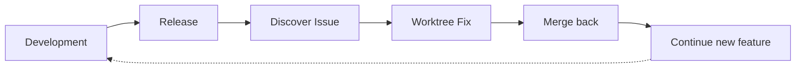

# Workflow Introduction

CCW provides two workflow systems: **Main Workflow** and **Issue Workflow**, working together to cover the complete software development lifecycle.

## Workflow Architecture Overview

```mermaid
graph TB
    subgraph Main["Main Workflow (5 Levels)"]
        L1["Level 1: Rapid<br/>lite-lite-lite"]
        L2["Level 2: Lightweight<br/>lite-plan, lite-fix, multi-cli-plan"]
        L3["Level 3: Standard<br/>plan, tdd-plan, test-fix-gen"]
        L4["Level 4: Brainstorm<br/>brainstorm:auto-parallel"]
        L5["Level 5: Intelligent<br/>ccw-coordinator"]
        L1 --> L2 --> L3 --> L4 --> L5
    end

    subgraph Issue["Issue Workflow (Post-Development)"]
        I1["Phase 1: Accumulation<br/>discover, new"]
        I2["Phase 2: Resolution<br/>plan, queue, execute"]
        I1 --> I2
    end

    Main -.->|After development| Issue

    classDef level1 fill:#e3f2fd,stroke:#1976d2
    classDef level2 fill:#bbdefb,stroke:#1976d2
    classDef level3 fill:#90caf9,stroke:#1976d2
    classDef level4 fill:#64b5f6,stroke:#1976d2
    classDef level5 fill:#42a5f5,stroke:#1976d2
    classDef issue fill:#fff3e0,stroke:#f57c00

    class L1 level1,L2 level2,L3 level3,L4 level4,L5 level5,I1,I2 issue
```

## Main Workflow vs Issue Workflow

| Aspect | Main Workflow | Issue Workflow |
|--------|---------------|----------------|
| **Purpose** | Primary development cycle | Post-development maintenance |
| **Timing** | Feature development phase | After main workflow completes |
| **Scope** | Complete feature implementation | Targeted fixes/enhancements |
| **Parallelism** | Dependency analysis + Agent parallel | Worktree isolation (optional) |
| **Branch Model** | Work on current branch | Can use isolated worktree |

### Why Main Workflow Doesn't Use Worktree Automatically?

**Dependency analysis already solves parallelism**:

1. Planning phase (`/workflow:plan`) performs dependency analysis
2. Automatically identifies task dependencies and critical paths
3. Partitions into **parallel groups** (independent tasks) and **serial chains** (dependent tasks)
4. Agents execute independent tasks in parallel without filesystem isolation

```mermaid
graph TD
    subgraph Dependency["Dependency Analysis"]
        A["Task A"]
        B["Task B"]
        C["Task C"]
        D["Task D"]

        A & B --> PG["Parallel Group 1<br/>Agent 1"]
        C --> SC["Serial Chain<br/>Agent 2"]
        D --> SC

        PG --> R["Results"]
        SC --> R
    end

    classDef pg fill:#c8e6c9,stroke:#388e3c
    classDef sc fill:#fff9c4,stroke:#f57c00

    class PG pg,SC sc
```

### Why Issue Workflow Supports Worktree?

Issue Workflow serves as a **supplementary mechanism** with different scenarios:

1. Main development complete, merged to `main`
2. Issues discovered requiring fixes
3. Need to fix without affecting current development
4. Worktree isolation keeps main branch stable



## 15 Workflow Levels Explained

### Level 1: Rapid Execution
**Complexity**: Low | **Artifacts**: None | **State**: Stateless

| Workflow | Description |
|----------|-------------|
| `lite-lite-lite` | Ultra-lightweight direct execution with zero overhead |

**Best for**: Quick fixes, simple features, config adjustments

---

### Level 2: Lightweight Planning
**Complexity**: Low-Medium | **Artifacts**: Memory/Lightweight files | **State**: Session-scoped

| Workflow | Description |
|----------|-------------|
| `lite-plan` | In-memory planning for clear requirements |
| `lite-fix` | Intelligent bug diagnosis and fix |
| `multi-cli-plan` | Multi-CLI collaborative analysis |

**Best for**: Single-module features, bug fixes, technology selection

---

### Level 2.5: Bridge Workflow
**Complexity**: Low-Medium | **Purpose**: Lightweight to Issue transition

| Workflow | Description |
|----------|-------------|
| `rapid-to-issue` | Bridge from quick planning to issue workflow |

**Best for**: Converting lightweight plans to issue tracking

---

### Level 3: Standard Planning
**Complexity**: Medium-High | **Artifacts**: Persistent session files | **State**: Full session management

| Workflow | Description |
|----------|-------------|
| `plan` | Complex feature development with 5 phases |
| `tdd-plan` | Test-driven development with Red-Green-Refactor |
| `test-fix-gen` | Test fix generation with progressive layers |

**Best for**: Multi-module changes, refactoring, TDD development

---

### With-File Workflows (Level 3-4)
**Complexity**: Medium-High | **Artifacts**: Documented exploration | **Multi-CLI**: Yes

| Workflow | Description | Level |
|----------|-------------|-------|
| `brainstorm-with-file` | Multi-perspective ideation | 4 |
| `debug-with-file` | Hypothesis-driven debugging | 3 |
| `analyze-with-file` | Collaborative analysis | 3 |

**Best for**: Documented exploration with multi-CLI collaboration

---

### Level 4: Brainstorming
**Complexity**: High | **Artifacts**: Multi-role analysis docs | **Roles**: 3-9

| Workflow | Description |
|----------|-------------|
| `brainstorm:auto-parallel` | Multi-role brainstorming with synthesis |

**Best for**: New feature design, architecture refactoring, exploratory requirements

---

### Level 5: Intelligent Orchestration
**Complexity**: All levels | **Artifacts**: Full state persistence | **Automation**: Complete

| Workflow | Description |
|----------|-------------|
| `ccw-coordinator` | Auto-analyze & recommend command chains |

**Best for**: Complex multi-step workflows, uncertain commands, end-to-end automation

---

### Issue Workflow
**Complexity**: Variable | **Artifacts**: Issue records | **Isolation**: Worktree optional

| Phase | Commands |
|-------|----------|
| **Accumulation** | `discover`, `discover-by-prompt`, `new` |
| **Resolution** | `plan --all-pending`, `queue`, `execute` |

**Best for**: Post-development issue fixes, maintaining main branch stability

## Choosing the Right Workflow

### Quick Selection Table

| Scenario | Recommended Workflow | Level |
|----------|---------------------|-------|
| Quick fixes, config adjustments | `lite-lite-lite` | 1 |
| Clear single-module features | `lite-plan -> lite-execute` | 2 |
| Bug diagnosis and fix | `lite-fix` | 2 |
| Production emergencies | `lite-fix --hotfix` | 2 |
| Technology selection, solution comparison | `multi-cli-plan -> lite-execute` | 2 |
| Multi-module changes, refactoring | `plan -> verify -> execute` | 3 |
| Test-driven development | `tdd-plan -> execute -> tdd-verify` | 3 |
| Test failure fixes | `test-fix-gen -> test-cycle-execute` | 3 |
| New features, architecture design | `brainstorm:auto-parallel -> plan -> execute` | 4 |
| Complex multi-step workflows, uncertain commands | `ccw-coordinator` | 5 |
| Post-development issue fixes | Issue Workflow | - |

### Decision Flowchart

```mermaid
flowchart TD
    Start([Start New Task]) --> Q0{Post-development<br/>maintenance?}

    Q0 -->|Yes| IssueW["Issue Workflow<br/>discover -> plan -> queue -> execute"]
    Q0 -->|No| Q1{Uncertain which<br/>commands to use?}

    Q1 -->|Yes| L5["Level 5: ccw-coordinator<br/>Auto-analyze & recommend"]
    Q1 -->|No| Q2{Requirements<br/>clear?}

    Q2 -->|Uncertain| L4["Level 4: brainstorm:auto-parallel<br/>Multi-role exploration"]
    Q2 -->|Clear| Q3{Need persistent<br/>session?}

    Q3 -->|Yes| Q4{Development type?}
    Q3 -->|No| Q5{Need multi-<br/>perspective?}

    Q4 -->|Standard| L3Std["Level 3: plan -> verify -> execute"]
    Q4 -->|TDD| L3TDD["Level 3: tdd-plan -> execute -> verify"]
    Q4 -->|Test Fix| L3Test["Level 3: test-fix-gen -> test-cycle"]

    Q5 -->|Yes| L2Multi["Level 2: multi-cli-plan"]
    Q5 -->|No| Q6{Bug fix?}

    Q6 -->|Yes| L2Fix["Level 2: lite-fix"]
    Q6 -->|No| Q7{Need planning?}

    Q7 -->|Yes| L2Plan["Level 2: lite-plan -> lite-execute"]
    Q7 -->|No| L1["Level 1: lite-lite-lite"]

    IssueW --> End([Complete])
    L5 --> End
    L4 --> End
    L3Std --> End
    L3TDD --> End
    L3Test --> End
    L2Multi --> End
    L2Fix --> End
    L2Plan --> End
    L1 --> End

    classDef level1 fill:#e3f2fd,stroke:#1976d2
    classDef level2 fill:#bbdefb,stroke:#1976d2
    classDef level3 fill:#90caf9,stroke:#1976d2
    classDef level4 fill:#64b5f6,stroke:#1976d2
    classDef level5 fill:#42a5f5,stroke:#1976d2
    classDef issue fill:#fff3e0,stroke:#f57c00

    class L1 level1,L2Plan,L2Fix,L2Multi level2,L3Std,L3TDD,L3Test level3,L4 level4,L5 level5,IssueW issue
```

### Complexity Indicators

System auto-evaluates complexity based on keywords:

| Weight | Keywords |
|--------|----------|
| +2 | refactor, migrate, architect, system |
| +2 | multiple, across, all, entire |
| +1 | integrate, api, database |
| +1 | security, performance, scale |

- **High complexity** (&gt;=4): Auto-select Level 3-4
- **Medium complexity** (2-3): Auto-select Level 2
- **Low complexity** (&lt;2): Auto-select Level 1

## Minimum Execution Units

**Definition**: A set of commands that must execute together as an atomic group to achieve a meaningful workflow milestone.

| Unit Name | Commands | Purpose |
|-----------|----------|---------|
| **Quick Implementation** | lite-plan -> lite-execute | Lightweight plan and execution |
| **Multi-CLI Planning** | multi-cli-plan -> lite-execute | Multi-perspective analysis and execution |
| **Bug Fix** | lite-fix -> lite-execute | Bug diagnosis and fix execution |
| **Verified Planning** | plan -> plan-verify -> execute | Planning with verification and execution |
| **TDD Planning** | tdd-plan -> execute | Test-driven development planning and execution |
| **Test Validation** | test-fix-gen -> test-cycle-execute | Generate test tasks and execute test-fix cycle |
| **Code Review** | review-session-cycle -> review-cycle-fix | Complete review cycle and apply fixes |

## Next Steps

- [Level 1: Ultra-Lightweight Workflows](./level-1-ultra-lightweight.mdx) - Learn about rapid execution
- [Level 2: Rapid Workflows](./level-2-rapid.mdx) - Lightweight planning and bug fixes
- [Level 3: Standard Workflows](./level-3-standard.mdx) - Complete planning and TDD
- [Level 4: Brainstorm Workflows](./level-4-brainstorm.mdx) - Multi-role exploration
- [Level 5: Intelligent Workflows](./level-5-intelligent.mdx) - Automated orchestration
- [FAQ](./faq.mdx) - Common questions and answers
