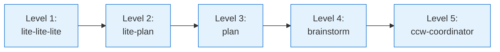

# Level 1: Ultra-Lightweight Workflows

**Complexity**: Low | **Artifacts**: None | **State**: Stateless | **Iteration**: Via AskUser

The simplest workflow for immediate simple tasks - minimal overhead, direct execution.

## Overview

Level 1 workflows are designed for quick, straightforward tasks that don't require planning, documentation, or persistent state. They execute directly from input to completion.

```mermaid
flowchart LR
    Input([User Input]) --> Clarify[Clarification<br/>Optional]
    Clarify --> Select{Auto-select<br/>CLI}
    Select --> Analysis[Parallel Analysis<br/>Multi-tool exploration]
    Analysis --> Results[Show Results]
    Results --> Execute[Direct Execute]
    Execute --> Done([Complete])

    classDef startend fill:#c8e6c9,stroke:#388e3c
    classDef action fill:#e3f2fd,stroke:#1976d2
    classDef decision fill:#fff9c4,stroke:#f57c00

    class Input,Done startend,Clarify,Select,Analysis,Results,Execute action,Select decision
```

## Included Workflow: lite-lite-lite

### Command

```bash
/workflow:lite-lite-lite
# Or CCW auto-selects for simple tasks
```

### Flow Diagram

```mermaid
flowchart TD
    A([User Input]) --> B{Clarification<br/>Needed?}
    B -->|Yes| C[AskUserQuestion<br/>Goal/Scope/Constraints]
    B -->|No| D[Task Analysis]
    C --> D

    D --> E{CLI Selection}
    E --> F[Gemini<br/>Analysis]
    E --> G[Codex<br/>Implementation]
    E --> H[Claude<br/>Reasoning]

    F --> I[Aggregate Results]
    G --> I
    H --> I

    I --> J{Direct<br/>Execute?}
    J -->|Yes| K[Execute Directly]
    J -->|Iterate| L[Refine via AskUser]
    L --> K

    K --> M([Complete])

    classDef startend fill:#c8e6c9,stroke:#388e3c
    classDef action fill:#e3f2fd,stroke:#1976d2
    classDef decision fill:#fff9c4,stroke:#f57c00

    class A,M startend,B,E,J decision,C,D,F,G,H,I,K action
```

### Characteristics

| Property | Value |
|----------|-------|
| **Complexity** | Low |
| **Artifacts** | None (no intermediate files) |
| **State** | Stateless |
| **CLI Selection** | Auto-analyze task type |
| **Iteration** | Via AskUser interaction |

### Process Phases

1. **Input Analysis**
   - Parse user input for task intent
   - Detect complexity level
   - Identify required CLI tools

2. **Optional Clarification** (if clarity_score < 2)
   - Goal: Create/Fix/Optimize/Analyze
   - Scope: Single file/Module/Cross-module
   - Constraints: Backward compat/Skip tests/Urgent hotfix

3. **CLI Auto-Selection**
   - Task type -> CLI tool mapping
   - Parallel analysis across multiple tools
   - Aggregated result presentation

4. **Direct Execution**
   - Execute changes immediately
   - No intermediate artifacts
   - Optional iteration via AskUser

### CLI Selection Logic

```javascript
function selectCLI(task) {
  const patterns = {
    'gemini': /analyze|review|understand|explore/,
    'codex': /implement|generate|create|write code/,
    'claude': /debug|fix|optimize|refactor/,
    'qwen': /consult|discuss|compare/
  };

  for (const [cli, pattern] of Object.entries(patterns)) {
    if (pattern.test(task)) return cli;
  }
  return 'gemini'; // Default
}
```

## Use Cases

### When to Use

- Quick fixes (simple typos, minor adjustments)
- Simple feature additions (single function, small utility)
- Configuration adjustments (environment variables, config files)
- Small-scope renaming (variable names, function names)
- Documentation updates (readme, comments)

### When NOT to Use

- Multi-module changes (use Level 2+)
- Need persistent records (use Level 3+)
- Complex refactoring (use Level 3-4)
- Test-driven development (use Level 3 TDD)
- Architecture design (use Level 4-5)

## Examples

### Example 1: Quick Fix

```bash
/workflow:lite-lite-lite "Fix typo in function name: getUserData"
```

**Flow**:
1. Detect: Simple typo fix
2. Select: Codex for refactoring
3. Execute: Direct rename across files
4. Complete: No artifacts generated

### Example 2: Simple Feature

```bash
/workflow:lite-lite-lite "Add logging to user login function"
```

**Flow**:
1. Detect: Single-module feature
2. Select: Claude for implementation
3. Clarify: Log level? Output destination?
4. Execute: Add log statements
5. Complete: Working code

### Example 3: Config Adjustment

```bash
/workflow:lite-lite-lite "Update API timeout to 30 seconds"
```

**Flow**:
1. Detect: Config change
2. Select: Gemini for analysis
3. Analysis: Find all timeout configs
4. Execute: Update values
5. Complete: Configuration updated

## Pros & Cons

### Pros

| Benefit | Description |
|---------|-------------|
| **Speed** | Fastest workflow, zero overhead |
| **Simplicity** | No planning or documentation |
| **Direct** | Input -> Execute -> Complete |
| **No Artifacts** | Clean workspace, no file clutter |
| **Low Cognitive Load** | Simple, straightforward execution |

### Cons

| Limitation | Description |
|------------|-------------|
| **No Trace** | No record of changes made |
| **No Planning** | Can't handle complex tasks |
| **No Review** | No built-in code review |
| **Limited Scope** | Single-module only |
| **No Rollback** | Changes are immediate |

## Comparison with Other Levels

| Aspect | Level 1 | Level 2 | Level 3 |
|--------|---------|---------|---------|
| **Planning** | None | In-memory | Persistent |
| **Artifacts** | None | Memory files | Session files |
| **Complexity** | Low | Low-Medium | Medium-High |
| **Traceability** | No | Partial | Full |
| **Review** | No | Optional | Built-in |

## When to Graduate to Higher Levels

**Signs you need Level 2+**:

- Task involves multiple modules
- Need to track progress
- Requirements need clarification
- Want code review
- Need test generation

**Migration path**:



## Related Workflows

- [Level 2: Rapid Workflows](./level-2-rapid.mdx) - Next level up with planning
- [Level 3: Standard Workflows](./level-3-standard.mdx) - Full session management
- [FAQ](./faq.mdx) - Common questions
